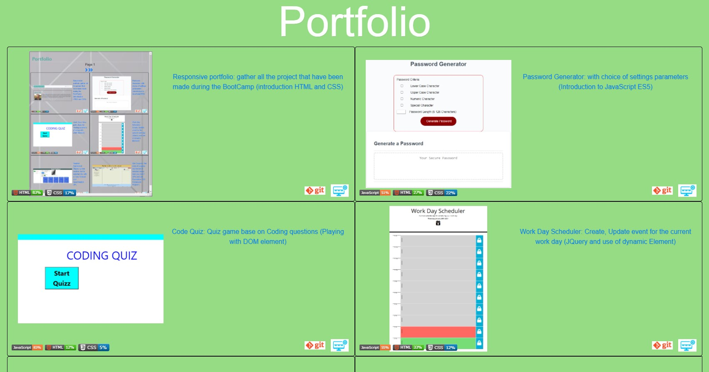

# Unit 02 CSS and Bootstrap Homework: Responsive Portfolio

Responsive design ensures that web applications render well on a variety of devices and window or screen sizes. As a developer, you will likely be asked to create a mobile-first application or add responsive design to an existing application. 

## index.html

presentation of myself, with tansition effet between pages

## portfolio.html

### contact.html

form to contact me by sending a message

## Commit Early and Often

One of the most important skills to master as a web developer is version control. Building the habit of committing via Git is important for two reasons:

* Your commit history is a signal to employers that you are actively working on projects and learning new skills.

* Your commit history allows you to revert your codebase in the event that you need to return to a previous state.

Follow these guidelines for committing:

* Make single-purpose commits for related changes to ensure a clean, manageable history. If you are fixing two issues, make two commits.

* Write descriptive, meaningful commit messages so that you and anyone else looking at your repository can easily understand its history.

* Don't commit half-done work, for the sake of your collaborators (and your future self!).

* Test your application before you commit to ensure functionality at every step in the development process.

We would like you to have well over 200 commits by graduation, so commit early and often!

## Links
- Github Repo: [https://github.com/nhounhou/Portfolio]
- Live Deployement: [https://nhounhou.github.io/Portfolio]

## Submission on BCS

You are required to submit the following:

* The URLs of the deployed applications

* The URLs of the GitHub repositories

- - -

© 2019 Trilogy Education Services, a 2U, Inc. brand. All Rights Reserved.

